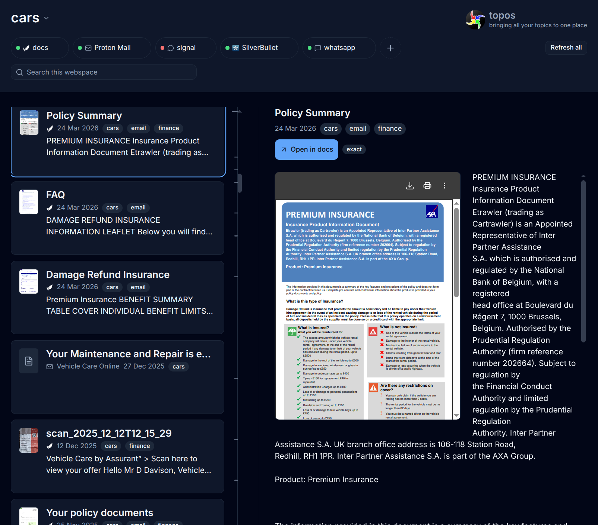
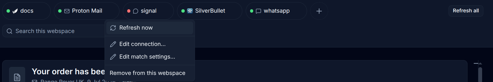
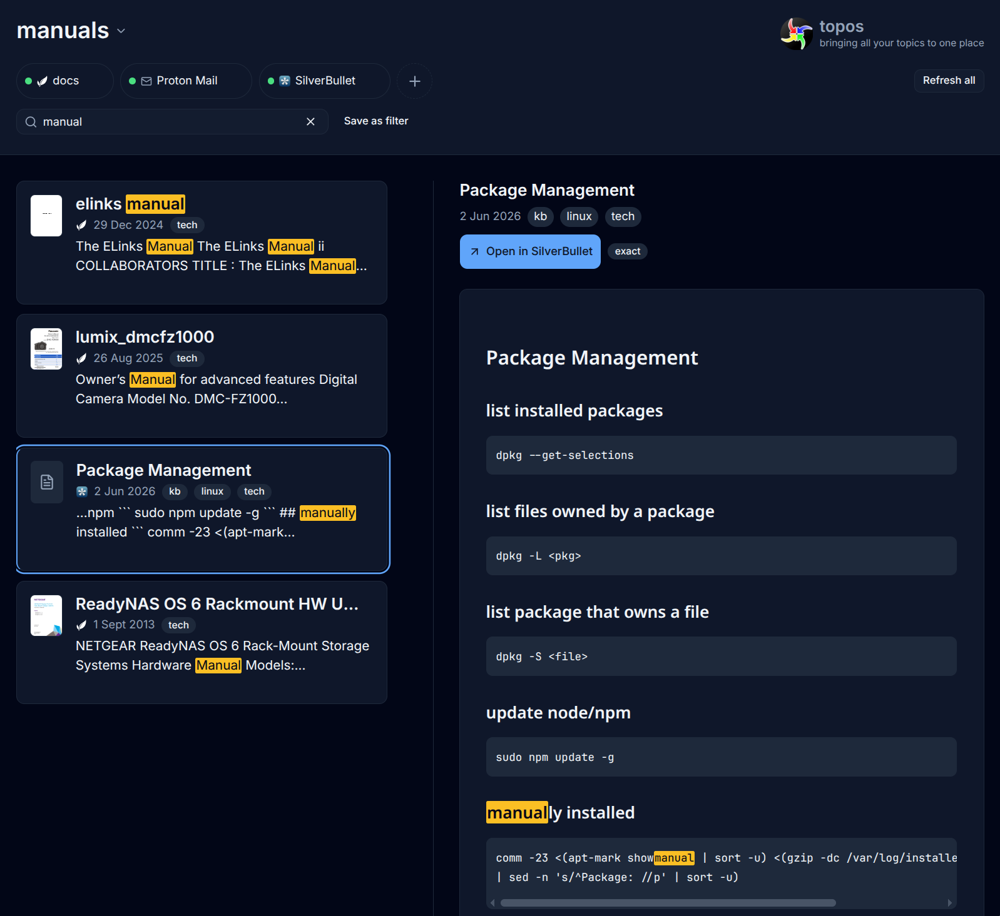
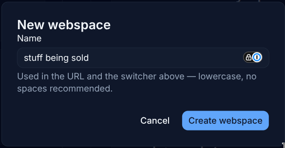

#  topos

topos pulls together related information from your disparate personal
data silos — email, chats, document storage, notes, wikis — into per-topic
"webspaces," so you can open one view and see everything related to a
topic instead of hunting across apps. It runs entirely on your own
desktop, is read-only against every source it touches, and never sends
your data anywhere else.

## Screenshots


_A webspace's chronological cross-source stream, with the detail pane
open on a selected item._
<!-- awaiting docs/ss/1.png — see docs/ss/README.md -->


_One merged chip per configured source instance: health, filter, and
manual refresh in a single affordance._
<!-- awaiting docs/ss/2.png — see docs/ss/README.md -->


_Full-text search across every source in a webspace, with matched terms
highlighted._
<!-- awaiting docs/ss/3.png — see docs/ss/README.md -->


_Creating a webspace and configuring its source instances entirely from
the browser._
<!-- awaiting docs/ss/4.png — see docs/ss/README.md -->

## Status

topos has completed 11 of its v1 phases. Six sources ship today —
paperless-ngx, SilverBullet, Proton Mail (via Bridge, never marking mail
read), Signal Desktop (read strictly read-only from its local database),
WhatsApp (as a linked device, with its own persistent message store), and
a local/network filesystem folder (docs in a directory, optionally its
subfolders) — interleaved in one chronological stream per webspace. You get source
filtering, per-source health with manual refresh, full-text search
across a webspace, a live detail pane, webspace creation and source
configuration entirely from the browser (no hand-editing TOML required
to get started), a default-deny agent permission model, and a responsive
layout that adapts down to mobile widths. This final phase (10) is
finishing the docs and release engineering that make the project easy to
pick up from the outside.

## Install

There are two ways to get a running `topos`: download a prebuilt release,
or build it from source.

### Prebuilt (recommended)

From a checkout, one command installs a verified release:

- `make install` — resolves and installs the latest published stable
  release (never a nightly or prerelease)
- `make install VERSION=<tag>` — installs exactly that release
- `make install PREFIX=$HOME/.local ...` — installs somewhere your user
  can write (the default `PREFIX` is `/usr/local`, which usually needs
  `sudo make install`)
- `make uninstall` — removes exactly what `make install` placed; your
  config, index, and plugin stores are never touched

Every downloaded file is SHA-256-verified against the release's own
`checksums.txt` before anything is placed. See
[`docs/install.md`](docs/install.md) for the full treatment.

Prefer to place files yourself? Download the binaries from the
[latest release](https://github.com/davison/topos/releases/latest):
`topos` (the kernel), `topos-plugin-paperless`,
`topos-plugin-silverbullet`, `topos-plugin-proton`,
`topos-plugin-whatsapp`, `topos-plugin-filesystem`, and
`checksums.txt`. Verify what you downloaded before running any of it:

```bash
sha256sum -c checksums.txt
```

Place `topos` somewhere on your `PATH` (or run it from wherever you put
it) and the five plugin binaries in a `plugins/` directory next to it —
this is the default `[plugins] dir` `config.example.toml` documents.

**Plugin binaries come from
[`topos-plugins`](https://github.com/davison/topos-plugins)** — the
source plugins live there now, and its signed releases carry the fleet;
kernel releases here ship the kernel alone. See
[`docs/install.md`](docs/install.md#plugins-on-an-installed-instance)
for the download-and-place path (and for Signal, the fleet's one cgo
build, which is never published prebuilt — build it from a
topos-plugins checkout against your own system's SQLCipher). Older
kernel releases still carry whatever their tag published.

### From source

Prerequisites:

- **Go 1.23+** (developed against 1.25).
- **Node 20+** (for building the SvelteKit web UI).
- The proto codegen toolchain (**`buf`**, or `protoc` +
  `protoc-gen-go` + `protoc-gen-go-grpc`) — only needed if you're
  regenerating `sdk/gen` from `proto/topos/v1/plugin.proto`; not
  needed for a normal build.

```bash
make build
```

Produces the SPA (embedded into the kernel binary), `bin/topos`, and the
plugin binaries under `bin/plugins/` — including the cgo-enabled Signal
plugin, since a from-source build already has (or will need) a C
toolchain. Use `make build-portable` instead if you want the same output
minus Signal, with no cgo requirement at all.

### As an app (PWA)

Once the kernel is running, topos installs like a desktop app.

Open the loopback address (`http://127.0.0.1:7777` by default) in a
Chromium-based browser or Edge, and use the browser's own install
affordance — the install icon in the address bar, or "Install topos" in
the browser's app menu. topos adds no install button of its own; the
browser owns that affordance entirely.

This works with no extra setup because `http://localhost`/`http://127.0.0.1`
on any port is a browser-recognized secure context, which is what
ServiceWorker registration and install eligibility both require — and the
kernel's default listener is already loopback.

**The limitation:** opening topos from another device on your LAN — a
phone, a tablet, another desktop — over a plain-HTTP LAN address such as
`http://192.168.1.20:7777` is *not* a secure context, so the browser will
not register a ServiceWorker and will not offer to install the app. The
page itself still loads and works over LAN; only installability is
unavailable there. This is a browser rule, not a topos bug — it's the
same secure-context requirement the kernel's own non-loopback listener
warning is the network-layer counterpart of (see "Run", below: binding
beyond loopback is a deliberate exposure decision the kernel warns about
at startup).

If you want to install topos from another device anyway, that means
putting real TLS in front of the kernel yourself — none of these are
something topos ships, all of them are things you run:

- **A reverse proxy you already trust**, terminating TLS with a
  certificate your devices already trust, forwarding to the kernel.
- **A mesh VPN that issues real certificates for its own hostnames**
  (this repo's own dev tooling already allowlists such hostnames — see
  `allowedHosts` in `web/vite.config.ts`).
- **A locally-generated certificate authority**, added to one trusted
  device's own trust store, for a single-device setup.

Whichever you pick, the kernel has to be reachable from wherever TLS
terminates, which means widening `[server] listen` beyond loopback — and
the kernel logs a warning when you do, deliberately, because that
widening is a real exposure decision (see "Run", below).

No built-in HTTPS listen mode is planned for this release; that's tracked
separately, with no date attached.

## Configure

topos needs two things from you: your source connection details in the
environment, and a config file describing your webspaces.

1. Set the connection details for whichever sources you're using as
   environment variables (put these in a `.env` file at the repo root for
   local development — it's gitignored — and `source` it, or `export`
   them in your shell directly):

   ```bash
   export PAPERLESS_URL="https://paperless.example.lan:8000"
   export PAPERLESS_TOKEN="<your paperless-ngx API token>"
   export SILVERBULLET_URL="https://silverbullet.example.lan:3000"
   export SB_AUTH_TOKEN="<your SilverBullet auth token>"
   export PROTON_BRIDGE_ADDR="<lan-address:port of your Bridge forwarder>"
   export PROTON_BRIDGE_USER="<Bridge-generated username>"
   export PROTON_BRIDGE_PASS="<Bridge-generated password>"
   export PROTON_WEBMAIL_BASE="https://mail.proton.me/u/0"
   ```

   Signal and WhatsApp need no environment variables at all — Signal's
   SQLCipher key is resolved at runtime from your OS keyring, and
   WhatsApp links as its own device via a one-time QR scan. See
   [`docs/plugins/`](docs/plugins/) for every source's own prerequisites
   and gotchas.

2. Copy the example config and edit it:

   ```bash
   mkdir -p ~/.config/topos
   cp config.example.toml ~/.config/topos/config.toml
   ```

   `config.example.toml` is a fully-commented reference — every key
   documents its purpose, default, and validation rule. At minimum,
   define at least one `[webspaces.<name>]` block with a `keywords` list
   matching your own paperless-ngx tag names (matching is exact and
   case-insensitive — see the comments in the example file for the exact
   rule and a worked counterexample). `keywords` is a webspace-level
   fallback applied across every source instance's own declared match
   fields; a per-instance `[webspaces.<name>.match.<instance>]` block
   (also documented in `config.example.toml`) replaces that fallback for
   one instance when you need typed, per-source matching instead — e.g.
   distinct `folders` for two configured email instances. If no
   `config.toml` exists on first run, topos bootstraps a default one for
   you and prompts you to create your first webspace.

## Run

```bash
./bin/topos serve
```

Then open `http://127.0.0.1:7777/w/<your-webspace-name>` in a browser.

The server binds `127.0.0.1` (loopback) only by default, and there is
no authentication on its HTTP API in v1 — that's the whole security
boundary for now. Binding it to a LAN interface is a deliberate decision
this project has not made; the server logs a warning at startup if it
detects a non-loopback bind, but does not refuse to start.

## Where to look next

- **[`CONTRIBUTING.md`](CONTRIBUTING.md)** — repository layout, the dev
  loop, and the testing gates, for anyone working on topos itself.
- **[`docs/plugin-contract.md`](docs/plugin-contract.md)** — the published
  contract for writing a new source plugin: the interface you implement,
  how the kernel discovers and launches your binary, how config reaches
  it, and what every `Item` field means.
- **[`docs/api.md`](docs/api.md)** — the complete kernel HTTP JSON
  contract: every route, the stable-id scheme, the ordering guarantee,
  provenance keys, and the full error-code list. This is the same JSON
  the web UI consumes — there is no separate agent API.
- **[`docs/plugins/`](docs/plugins/)** — per-plugin operator docs: install
  requirements, configuration, and gotchas for each of the six source
  plugins.
- **[`SECURITY.md`](SECURITY.md)** — how to report a vulnerability.
- **[`docs/releasing.md`](docs/releasing.md)** — how a release is cut,
  what the nightly build does, and GitHub milestone sync.
- **[`.planning/`](.planning/)** — this project's phase-by-phase
  requirements, design decisions, and roadmap.

## Credits

Built with [Claude](https://www.anthropic.com/claude), by Anthropic, using
the [openGSD](https://github.com/open-gsd/gsd-core) planning and
execution workflow.
